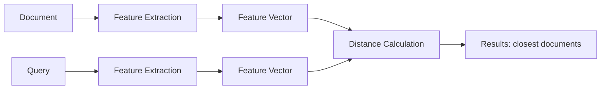

# Information Retrieval: Introduction

## Context

### Digital Data Production

The quantity of data produced each year reaches phenomenal orders of magnitude. We are talking about zettabytes, where

$$ 1 \text{ zettabyte} = 2^{70} \text{ bytes} = 10^{21} \text{ bytes} \approx 1 \text{ billion terabytes}. $$

This digital explosion concerns all domains: photos, videos, messages, transactions, etc.

### A Digital World

The volume of photos taken each year illustrates this exponential growth. Millions, then billions of shots are captured daily, feeding massive databases.

### A World in Evolution

Between 2012 and 2024, platforms like YouTube saw their uploaded content volume multiplied by 15 (going from 30 hours to 500 hours per minute). This trend underscores the crying need for effective methods to organize, search, and exploit these masses of information.

---

## Understanding User Needs

- Informed decision-making relies on informed choices.
- The information avalanche imposes advanced information management processes.
- Access to large information reservoirs enables the emergence of Data Science.

It is therefore necessary to bring structure to raw data via:

- An appropriate representation of documents.
- Adequate similarity measures.
- Analysis processes: mining, learning, visualization.

---

## Distance as a Key Element

The notion of distance (or similarity) is fundamental for comparing documents or objects.

### Uses of Distance

- **Data Mining**: unsupervised analysis (clustering, anomaly detection, imputation…).
- **Learning**: supervised models (classification, regression…).
- **Visualization**: dimensionality reduction to project data into an understandable space.

Features allow summarizing a document; distance allows comparing two documents (similarity, patterns) and also characterizing a document model (visualization).

---

## Definition of Information Retrieval

The main objective of Information Retrieval (IR) is to respond to an information need expressed by a query. The goal is to automatically bring forth relevant information from a large collection of documents using a query formalism that is often flexible and not very constrained.

---

## History of Information Retrieval

- **1950**: Calvin N. Moors invents the term "Information Retrieval".
- **1959**: Hans Peter Luhn describes statistical retrieval (automatic indexing based on word frequencies).
- **1960**: Maron and Kuhns define a probabilistic IR model.
- **1966**: The Cranfield project establishes evaluation measures (recall, precision).
- **1968**: Gerard Salton publishes the first book on the SMART system.
- **1972**: Lockheed introduces DIALOG, a commercial online service.
- **Late 1980s**: First PC systems integrating search capabilities.
- **Early 1990s**: Cheap disks → storage revolution.
- **1992**: Westlaw uses a large-scale probabilistic model.
- **Mid-1990s**: Multimedia databases.
- **1994**: Explosion of the Internet and the Web.
- **1995**: IR techniques become ubiquitous (search button).
- **Today**: Use of embeddings from machine learning for search.

---

## Course Objectives

- Understand the basic models of information retrieval.
- Understand social recommendation.
- Master quality measures (evaluation).
- Know the specificities of different media.
- Overview of indexing techniques.
- Overview of data visualization.

This course is part of the continuity of teachings in Data Science and Machine Learning.

---

## Course Content

### Embeddings: Vector Representation of Data

- Sparse embeddings
  - TF-IDF
  - Vector search
  - Latent Semantic Indexing (LSI)
- Probabilistic models
- Dense embeddings
  - Neural embeddings
- Learning to Rank

### Indexing: Speeding Up Search

- Index structures
- Fast search algorithms

### Information Retrieval Evaluation

- Precision, recall, F-measure metrics
- Experimental protocols

### Social Information Retrieval and Recommendation

- Recommender systems
- Social network analysis

### Media Specificities

- Text properties
- Visual information retrieval (images, videos)
- Audio information retrieval

### Information Visualization

- Manifold learning
- Dimensionality reduction

---

## General References

Detailed references by chapter will be provided later. Here is a list of reference works for the course:

1. Charu C. Aggarwal. *Recommender Systems: The Textbook*. Springer, 1st edition, 2016.
2. Ricardo Baeza-Yates and Berthier Ribeiro-Neto. *Modern Information Retrieval: The Concepts and Technology behind Search*. Addison-Wesley, 2nd edition, 2011.
3. Michael W. Berry and Jacob Kogan (editors). *Text Mining: Applications and Theory*. Wiley, 2010.
4. Stefan Buttcher, Charles L. A. Clarke, and Gordon V. Cormack. *Information Retrieval: Implementing and Evaluating Search Engines*. MIT Press, 2010.
5. S. Ceri, A. Bozzon, M. Brambilla, E. Della Valle, P. Fraternali, and S. Quarteroni. *Web Information Retrieval*. Springer, 2013.
6. W. Bruce Croft and J. Lafferty (editors). *Language Models for Information Retrieval*. Kluwer Academics, 2002.
7. W. Bruce Croft, Donald Metzler, and Trevor Strohman. *Search Engines: Information Retrieval in Practice*. Pearson Education, 2015. (available online)
8. Sandor Dominich. *The Modern Algebra of Information Retrieval*. Springer, 2008.
9. Daniel Jurafsky and James H. Martin. *Speech and Language Processing: An Introduction to Natural Language Processing, Computational Linguistics, and Speech Recognition with Language Models*. University of Stanford, 3rd edition, 2026. (available online)
10. Tie-Yan Liu. *Learning to Rank for Information Retrieval*. Springer, 2011.
11. Christopher D. Manning, Prabhakar Raghavan, and Hinrich Schütze. *An Introduction to Information Retrieval*. Cambridge University Press, 2009.
12. Massimo Melucci. *Introduction to Information Retrieval and Quantum Mechanics*. Springer, 2015.
13. Bhaskar Mitra and Nick Craswell. *An Introduction to Neural Information Retrieval*. NOW, 2018.
14. Nicola Tonellotto. *Lecture notes on neural information retrieval*. CoRR, abs/2207.13443, 2022.
15. ChengXiang Zhai and Sean Massung. *Text Data Management and Analysis*. Morgan & Claypool, 2016.

Any suggestions or feedback are welcome!
